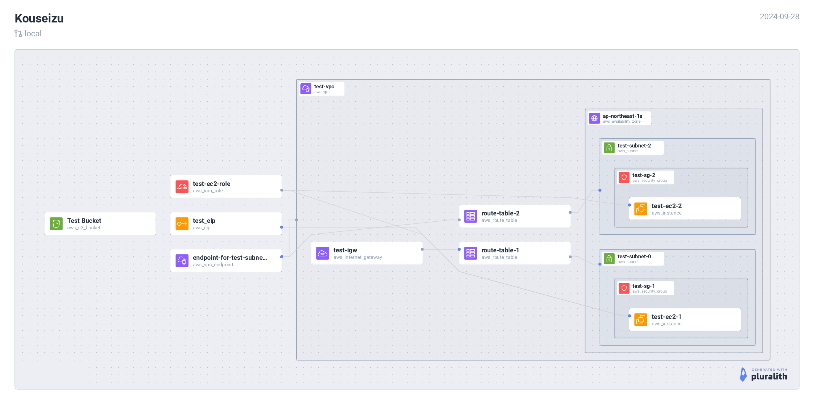

# VPCエンドポイントとは
セキュリティ向上のため、VPC内のリソースが、インターネットを介さずにAWSのサービスにアクセスできるようにするコンポーネントのこと。ほかにも、AWSサービスへの通信はインターネットを経由しなくなるNATのコストを下げることにもつながる。

例えば、S3などにprivate subnet内のEC2からアクセスさせることができる。

## インターフェース型
ENIがsubnetにアタッチされ、これがプライベートIPアドレスを持つ。これで、AWS内部のサービスとインターフェースが通信できるようになる。このプライベートIPアドレスは、VPC内部というより、AWS内部で有効なアドレスである模様。

## ゲートウェイ型（無料）
利用するAWSのサービスへのエイリアス（com.amazonaws.us-east-1.s3みたいなもの）がルートテーブルにのり、そちらにトラフィックが向く。今回はこちらを試行。

# やったこと概要
- public subnetとprivate subnetを作成し、それぞれにEC2インスタンスを配置
- S3バケットを設置
- EC2インスタンス内から、S3のバケットリストを取得することを試みる
  - private subnet内のEC2インスタンスからは失敗する
- VPCエンドポイントを設定
  - private subnetのルートテーブルにS3へのエントリが追加され、S3バケットリスト取得が成功する。

下図は、Pluralithでterraformファイルから自動作図


vpc_endpoint.tf

```jsx
// private subnetからS3へ通信できるよう、Gateway型のエンドポイントを設定
resource "aws_vpc_endpoint" "endpoint_for_test_subnet_2" {
  vpc_id       = aws_vpc.test_vpc.id
  service_name = "com.amazonaws.ap-northeast-1.s3"

  policy = jsonencode({
    Version = "2012-10-17"
    Statement = [
      {
        Action    = "*"
        Effect    = "Allow"
        Principal = "*"
        Resource  = "*"
      }
    ]
  })

  route_table_ids = [aws_route_table.route_table_2.id]

  tags = {
    Name = "endpoint-for-test-subnet-2"
  }
}
```

route_table.tf
```jsx
// private subnetのルートテーブル
resource "aws_route_table" "route_table_2" {
  vpc_id = aws_vpc.test_vpc.id

  tags = {
    Name = "route-table-2"
  }
}

resource "aws_route_table_association" "route_table_association_2" {
  subnet_id      = aws_subnet.test_subnet_2.id
  route_table_id = aws_route_table.route_table_2.id
}

// VPCエンドポイントをルートに追加
resource "aws_vpc_endpoint_route_table_association" "endpoint_route_table_association_2" {
  route_table_id  = aws_route_table.route_table_2.id
  vpc_endpoint_id = aws_vpc_endpoint.endpoint_for_test_subnet_2.id
}
```
